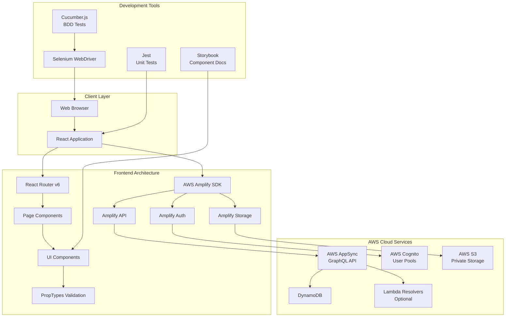
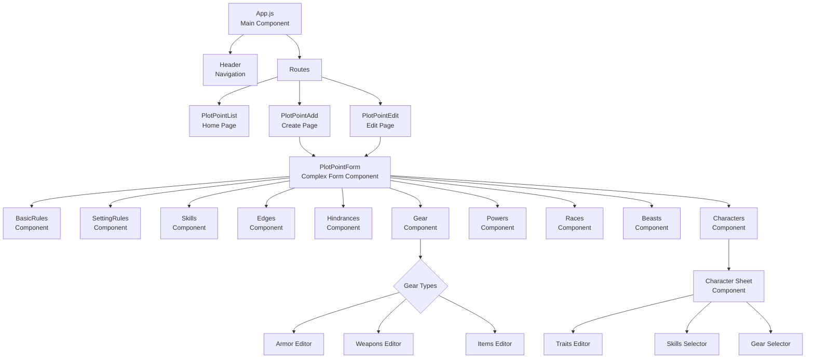
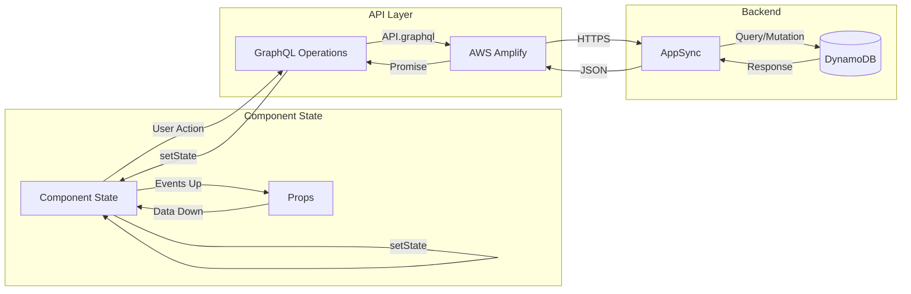
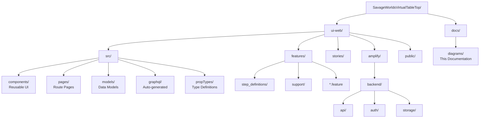
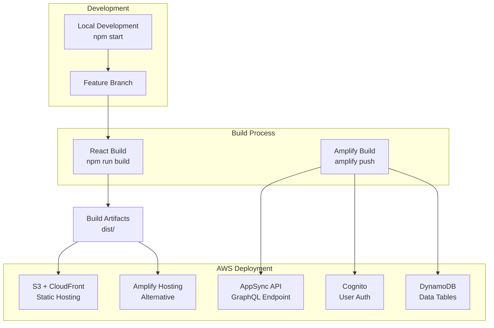
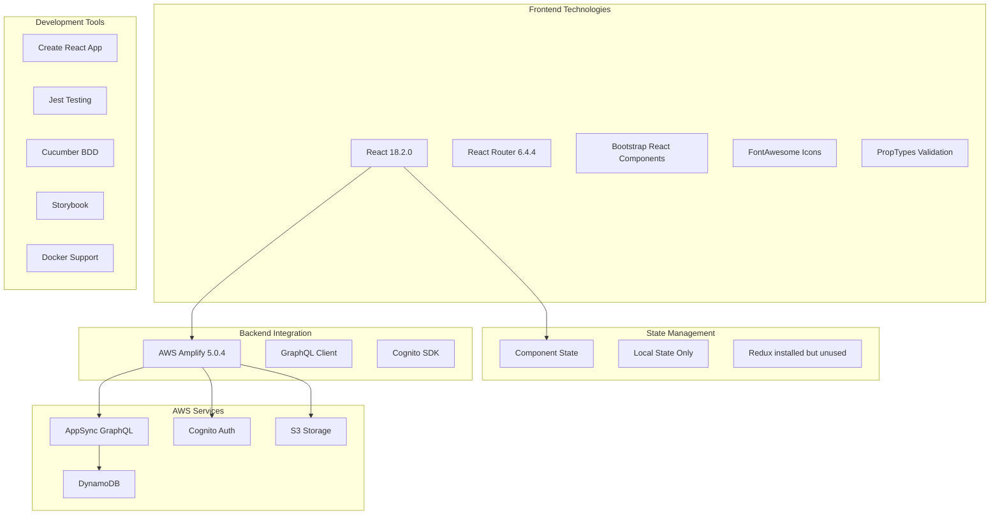

# Architecture Diagrams

This document contains architecture diagrams for the Savage Worlds Virtual Table Top application.

## System Architecture Overview

## Component Architecture

## Data Flow Architecture

## Directory Structure

## Deployment Architecture

## Technology Stack Layers

## Key Architectural Decisions

1. **Monolithic Frontend**: Single React application handles all functionality
2. **AWS-First Backend**: Leverages AWS managed services exclusively
3. **GraphQL API**: All data operations through AppSync GraphQL
4. **Component State**: No global state management (Redux unused)
5. **Class Components**: Primarily class-based React components
6. **BDD Testing**: Cucumber for integration testing
7. **Auto-generated Code**: GraphQL operations generated by Amplify