# Data Model ERD

This document contains the Entity Relationship Diagram for the Savage Worlds Virtual Table Top application.

## Entity Relationship Diagram

```mermaid
erDiagram
    PlotPoint ||--o{ Character : contains
    PlotPoint ||--o{ Beast : contains
    PlotPoint ||--o{ Edge : contains
    PlotPoint ||--o{ Hindrance : contains
    PlotPoint ||--o{ Skill : contains
    PlotPoint ||--o{ Power : contains
    PlotPoint ||--o{ Race : contains
    PlotPoint ||--o{ BasicRules : has
    PlotPoint ||--o{ SettingRule : contains
    PlotPoint ||--o{ Armor : contains
    PlotPoint ||--o{ HandWeapon : contains
    PlotPoint ||--o{ RangedWeapon : contains
    PlotPoint ||--o{ SpecialWeapon : contains
    PlotPoint ||--o{ Ammunition : contains
    PlotPoint ||--o{ MundaneItem : contains
    PlotPoint ||--o{ AirVehicle : contains
    PlotPoint ||--o{ GroundVehicle : contains
    PlotPoint ||--o{ WaterVehicle : contains

    Character ||--|| Trait : "has attributes"
    Character }o--o{ Edge : "selects via SelectedEdge"
    Character }o--o{ Hindrance : "selects via SelectedHindrance"
    Character }o--o{ Skill : has
    Character }o--o{ SpecialAbility : has
    Character }o--o{ Gear : "carries via SelectedGear"
    Character }o--|| Race : "belongs to"

    Beast ||--|| Trait : "has attributes"
    Beast }o--o{ Skill : has
    Beast }o--o{ SpecialAbility : has

    Edge }o--|| EdgeCategory : "belongs to"
    Edge ||--o{ EdgeRequirement : "has requirements"
    EdgeRequirement }o--|| Edge : "requires edge"
    EdgeRequirement }o--|| Skill : "requires skill"

    Skill }o--|| Attributes : "linked to"

    Power }o--o{ ArcaneBackground : "available to"
    Power ||--o{ Trapping : has
    Trapping ||--o{ TrappingEffect : has

    Race ||--o{ RaceAbility : has

    Armor ||--|| GearEra : "from era"
    Armor ||--|| GearKind : "of kind"
    HandWeapon ||--|| GearEra : "from era"
    HandWeapon ||--|| GearKind : "of kind"
    HandWeapon ||--|| Damage : "deals"
    RangedWeapon ||--|| GearEra : "from era"
    RangedWeapon ||--|| GearKind : "of kind"
    RangedWeapon ||--|| Damage : "deals"
    SpecialWeapon ||--|| GearEra : "from era"
    SpecialWeapon ||--|| GearKind : "of kind"
    SpecialWeapon ||--|| Damage : "deals"
    Ammunition ||--|| GearEra : "from era"
    Ammunition ||--|| GearKind : "of kind"
    MundaneItem ||--|| GearEra : "from era"
    MundaneItem ||--|| GearKind : "of kind"

    Damage ||--o{ Dice : contains

    PlotPoint {
        string id PK
        string name
        string description
        timestamp createdAt
        timestamp updatedAt
        string owner
    }

    Character {
        string id PK
        string name
        string description
        Trait attributes
        int wounds
        int fatigue
        int powerPoints
        int bennies
    }

    Beast {
        string id PK
        string name
        string description
        Trait attributes
        int wounds
        int fatigue
    }

    Trait {
        DiceType strengthDice
        int strengthBonus
        DiceType agilityDice
        int agilityBonus
        DiceType vigorDice
        int vigorBonus
        DiceType smartsDice
        int smartsBonus
        DiceType spiritDice
        int spiritBonus
    }

    Edge {
        string id PK
        string name
        string description
        Rank rank
        EdgeCategory category
    }

    Hindrance {
        string id PK
        string name
        string description
        HindranceSeverity severity
    }

    Skill {
        string id PK
        string name
        string description
        Attributes attribute
    }

    Power {
        string id PK
        string name
        string description
        int powerPoints
        string range
        string duration
    }

    Gear {
        string id PK
        string name
        string description
        int cost
        float weight
    }
```

## Key Relationships Explained

### PlotPoint as Aggregate Root
The `PlotPoint` entity serves as the central aggregate root, containing all game-related data for a campaign or setting. It maintains collections of:
- Characters and Beasts (NPCs/creatures)
- Game rules (BasicRules, SettingRules)
- Character options (Edges, Hindrances, Skills, Powers, Races)
- Equipment (various Gear types and Vehicles)

### Character Relationships
Characters have complex relationships:
- **Attributes**: Direct composition with Trait entity
- **Many-to-Many relationships** through join entities:
  - SelectedEdge (tracks which edges a character has)
  - SelectedHindrance (tracks hindrances with chosen severity)
  - SelectedGear (tracks equipment with quantities)
- **Direct Many-to-Many**: Skills and SpecialAbilities

### Equipment Hierarchy
The schema uses inheritance with:
- `Gear` interface implemented by: Armor, HandWeapon, RangedWeapon, SpecialWeapon, Ammunition, MundaneItem
- `Vehicle` interface implemented by: AirVehicle, GroundVehicle, WaterVehicle

### Edge Prerequisites
Edges can have complex requirements through `EdgeRequirement`:
- Can require other Edges (creating a dependency tree)
- Can require specific Skill levels
- Can require certain character Ranks

## Enumerations

- **DiceType**: d4, d6, d8, d10, d12
- **Attributes**: strength, agility, vigor, smarts, spirit
- **Rank**: novice, seasoned, veteran, heroic, legendary
- **HindranceSeverity**: minor, major, either
- **SelectedSeverity**: minor, major (for character's chosen severity)
- **BurstTemplate**: small, medium, large (for area effect weapons)