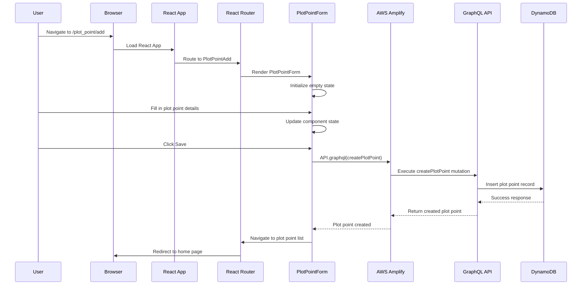
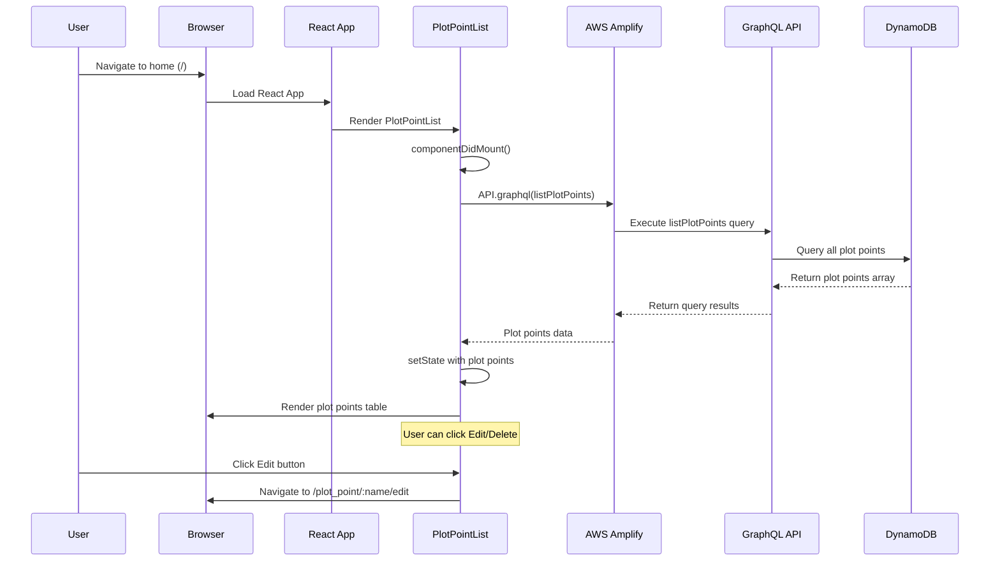
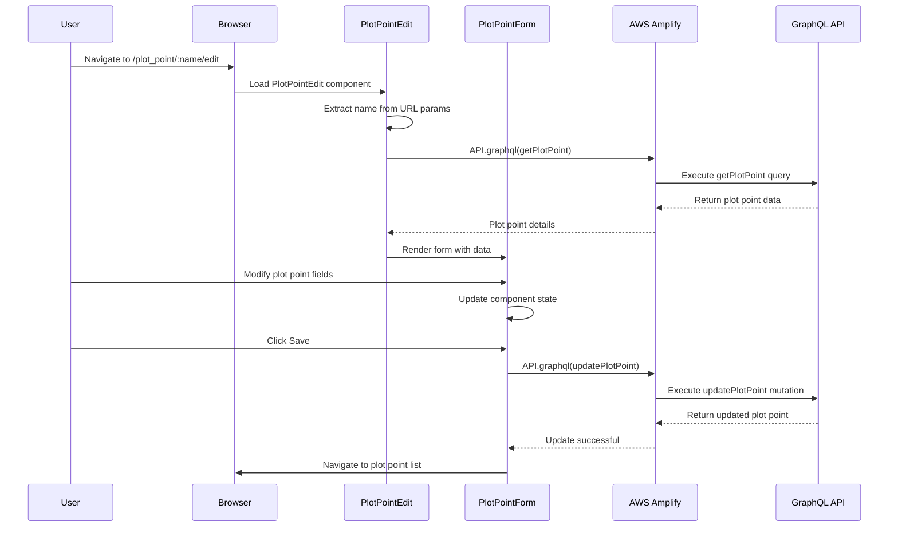
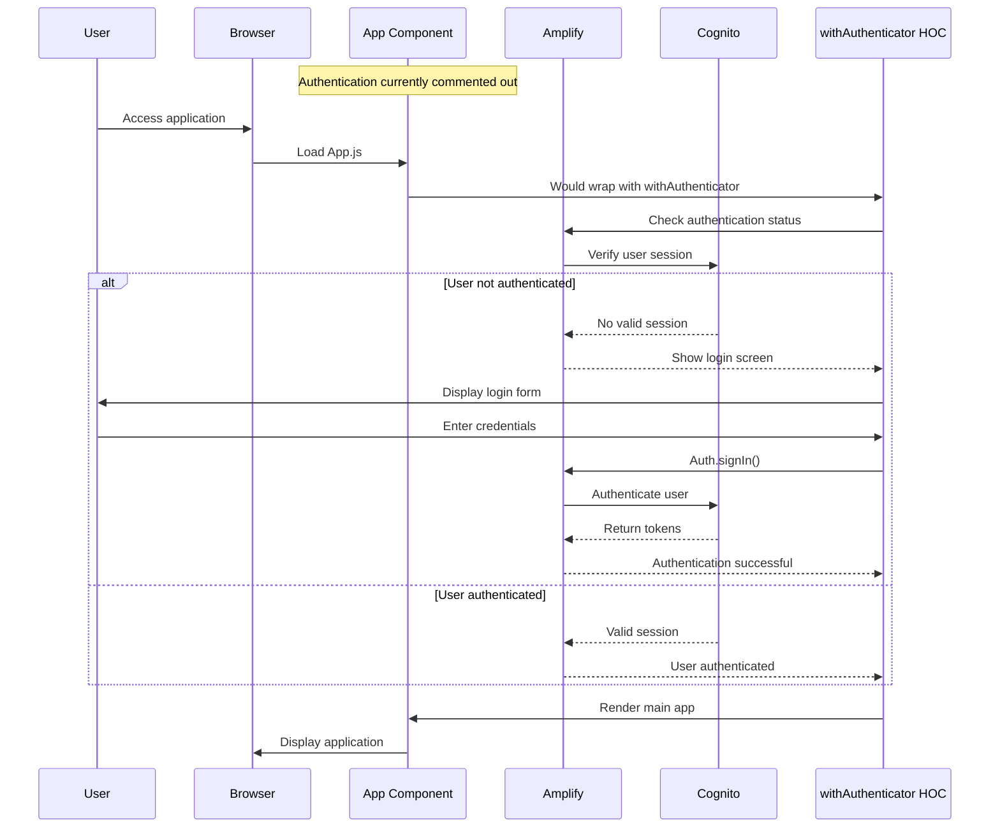
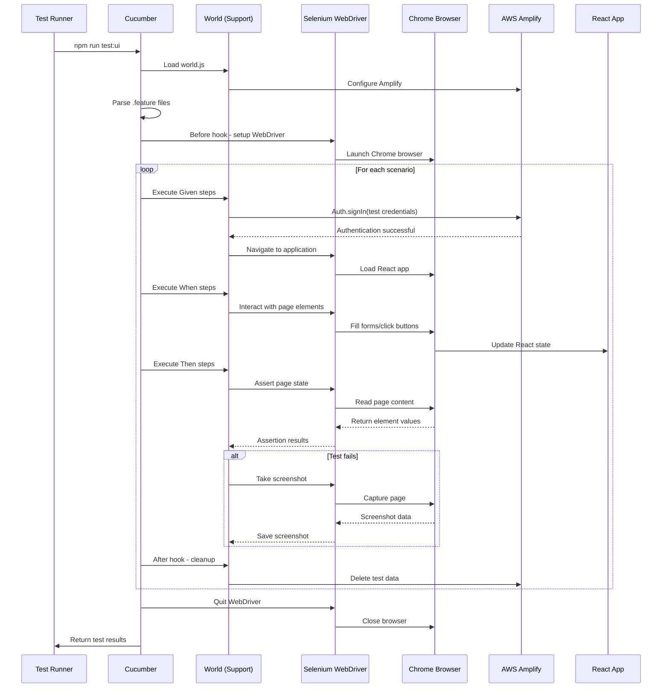
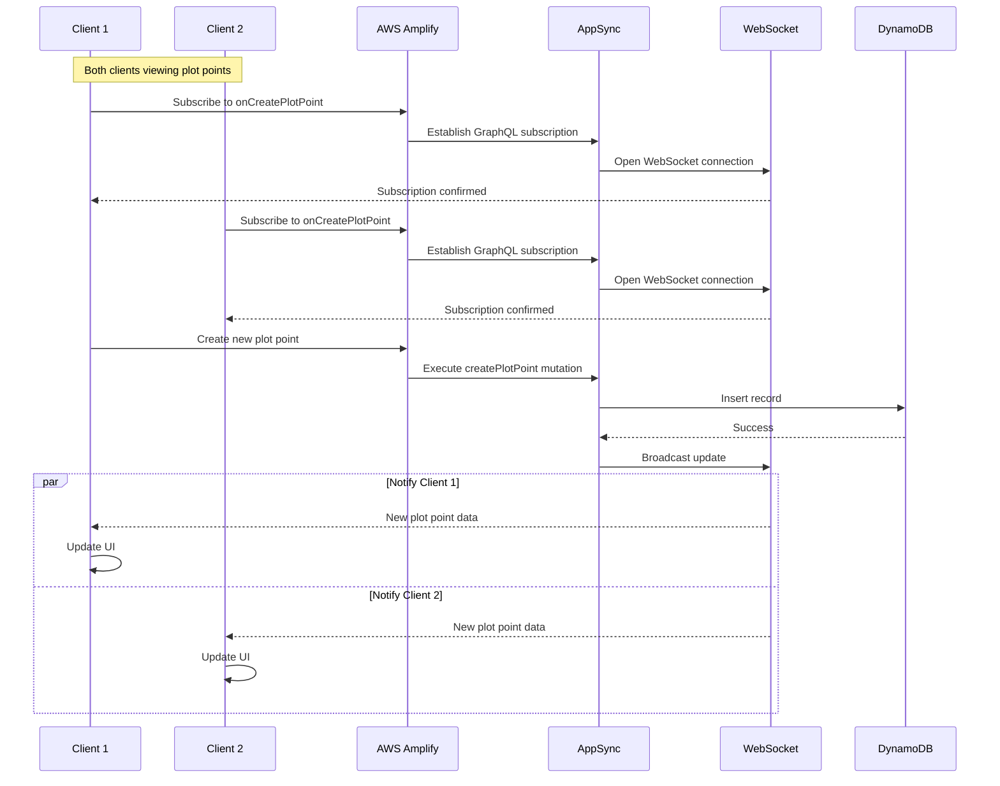

# Sequence Diagrams

This document contains sequence diagrams for key workflows in the Savage Worlds Virtual Table Top application.

## 1. Create Plot Point Workflow

## 2. List Plot Points Workflow

## 3. Edit Plot Point Workflow

## 4. Authentication Flow (Currently Disabled)

## 5. Cucumber BDD Test Execution

## 6. GraphQL Subscription Flow (Real-time Updates)

## Key Workflow Patterns

1. **Component Lifecycle**: Most data fetching happens in `componentDidMount()` for class components
2. **State Management**: Direct component state updates using `setState()`
3. **API Calls**: All GraphQL operations go through AWS Amplify's `API.graphql()`
4. **Navigation**: React Router handles client-side routing
5. **Error Handling**: Currently minimal - most workflows assume success
6. **Authentication**: Designed to use AWS Cognito but currently disabled